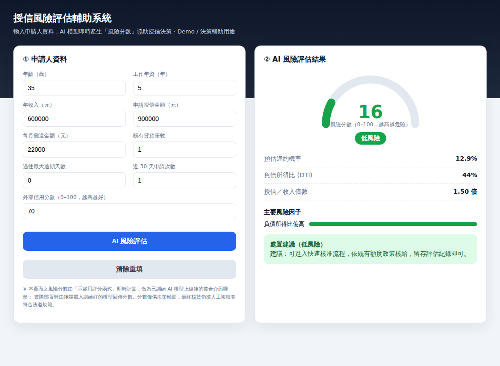

# Home Credit 信用風險評估 — 簡報 + 授信 AI 輔助網頁

資料來源：**Kaggle —「Home Credit Default Risk」競賽**。依附件 `spec.md` 與 `Home_Credit_2024…xlsx`（465 欄特徵字典）製作的成果，包含：
1. **業務導向簡報**（7 張）：資料為何能預測違約、前處理與機器學習流程、模型產出的風險分數、以及授信實務應用。
2. **授信風險評估輔助網頁**：授信人員輸入申請人資料 → AI 模型即時產生「風險分數」與處置建議。

> 依需求，簡報刻意以高層次商業語言呈現，**不指名具體演算法或函式工具**。

## 檔案

| 檔案 | 說明 |
|---|---|
| `build_slides.py` | **單一資料來源**：7 張投影片內容。產生 `.pptx` 與 `batch_update.json`。 |
| `home_credit_slides.pptx` | 可立即檢視的本機簡報。 |
| `batch_update.json` | Google Slides API `batchUpdate` 請求。 |
| `create_slides.sh` | 用 gws 建立 Google Slides 並寫入內容。 |
| `credit_risk_app/index.html` | **授信風險評估輔助網頁**（自含 HTML/CSS/JS，雙擊即可開啟）。 |
| `deck_title.txt` | 簡報標題。 |

## 一、簡報內容（7 張）

1. 封面
2. **為什麼這些資料能預測違約風險** —— 過往還款行為、負債/收入結構、既有信貸、申請頻率、金流穩定度、申請人輪廓等互補訊號。
3. **資料前處理與機器學習流程（總覽）** —— EDA → 清理 → 特徵工程 → 切分(Split) → 訓練/評估 → 產出風險分數。
4. **模型產出：風險分數的意義** —— 單一分數、對應違約機率、低/中/高分級、可解釋因子、重視時間穩定度。
5. **實務應用：AI 輔助授信流程** —— 即時分數分流（核准/複審/婉拒），AI 為輔助而非取代。
6. **網頁設計** —— 對應隨附的 `credit_risk_app/index.html`。
7. 價值與結論。

## 二、授信風險評估輔助網頁

實際畫面：



直接用瀏覽器開啟 `credit_risk_app/index.html` 即可：

- **輸入**：年齡、年資、年收入、授信金額、月攤還、既有貸款數、過往逾期天數、近 30 天申請次數、外部信用分數。
- **輸出**：風險分數（0–100 儀表）、風險等級（低/中/高）、預估違約機率、負債所得比 (DTI)、授信/收入倍數、**主要風險因子**排序、以及對應的**處置建議**。

> 網頁內的分數由「示範用評分函式」即時計算，作為**已訓練模型上線後的整合介面雛形**；
> 實際部署時改由後端載入訓練好的模型回傳分數。分數僅供決策輔助，最終核貸仍須人工複核並符合法遵規範。

## 三、產出 Google Slides（在本機已認證的 gws）

> 本雲端環境未安裝 gws 且無法做 Google OAuth，故無法在此直接推送；請於本機執行：

```bash
npm install -g @googleworkspace/cli   # 安裝 gws
gws auth login                        # 瀏覽器 OAuth（需 Slides 權限）
cd home-credit-slides
python3 build_slides.py               # 產生 batch_update.json
bash create_slides.sh                 # 建立並填入 Google Slides，輸出可開啟連結
```

gws 將 Discovery 的 path/query 參數對應到 `--params`、request body 對應到 `--json`；
若旗標與版本不同，先用 `gws schema slides.presentations.batchUpdate` 確認再微調。

---

### 資料集備註
附件特徵字典（`_1115A`、`_319D`、`_368M`…）屬 2024「Home Credit – Credit Risk Model Stability」競賽
（主鍵 `case_id`、含 `WEEK_NUM`、強調模型穩定度）；`spec.md` 則為 2018 版（主鍵 `SK_ID_CURR`）。
兩者流程相通，本成果以 2024 實際資料為準。
